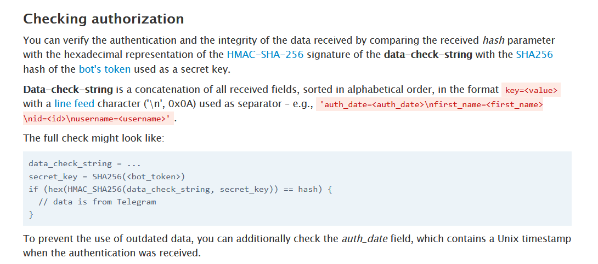

# Overview

User authentication is a critical aspect of web applications, ensuring that only legitimate users gain access to protected resources. When integrating third-party authentication systems, such as the Telegram Login Widget, it becomes crucial to validate the received data on the server side. In this article, we'll delve into the process of hash verification and its significance in maintaining the security of your web application.

# Authentication with Telegram Login Widget

In the context of my web application, I chose to leverage the Telegram Login Widget for user authentication. Once the user's details are verified by Telegram, the server receives user data along with a hash. To ensure the integrity of this data, I implemented a callback URL on the backend. This callback allows me to perform an additional verification step independently while also making use of the data.

## Verification steps

Hash Signature Verification:

-The received hash is signed by my Telegram bot token, generated through BotFather on Telegram.
-Verification is carried out using the Hash-Based Message Authentication Code (HMAC), adhering to Telegram's recommended security practices.



```javascript
// Example code using @telegram-auth/server
const validator = new AuthDataValidator({ botToken: "your_bot_token" });
const user = await validator.validate(dataFromTelegram);
```

Fortunately, I found a helpful public repository named @telegram-auth/server that streamlines the validation process, sparing me from implementing it from scratch.

# Importance of Hash Verification

1. Security Assurance

   - Hash verification is a fundamental security measure. It ensures that the data received from the Telegram Login Widget has not been tampered with during transmission.
   - By confirming the signature, we can trust that the data originated from Telegram and has not been manipulated by malicious actors.

2. Data Integrity

   - Hash verification guarantees the integrity of the user data. Any modifications to the data would result in a signature mismatch, signaling potential security threats.

3. Preventing Replay Attacks:

   - The timestamp included in the data can be used to establish the data's validity window. Hash verification, combined with a time check, prevents replay attacks where attackers attempt to reuse authentication data after a certain period.

# Conclusion

In conclusion, implementing robust hash verification on the server side is paramount for the security of your web application, especially when dealing with third-party authentication systems like the Telegram Login Widget. By ensuring the integrity and authenticity of user data, you establish a secure foundation, protecting your system from potential threats and providing users with a trustworthy authentication experience.
