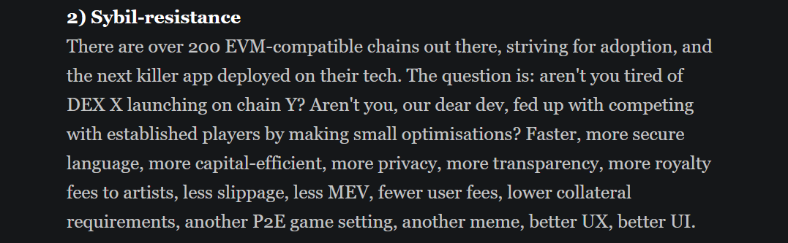

## Introduction

Humanode has captivated my interest since late 2021, a period during which I actively participated in its testnet phase. This project stands out as a pioneering endeavor in the realm of crypto-biometrics, proposing a network where each human acts as a unique node.

My fascination with Humanode stems from its innovative solution to uniquely identify users on the blockchain, ensuring the security of their data while preserving the system's decentralized ethos.

Without delving too deeply into the technicalities, this approach essentially ensures that participants are distinct individuals, addressing the critical issue of Sybil resistance in cryptocurrency networks.

## Understanding Sybil Resistance

### What is Sybil resistance

Now what is sybil resistance- you will say?

It basically refers to how a blockchain network can withstand sybil attacks.

## Defining sybil attacks

According to wikipedia, a Sybil attack is:

```
a type of attack on a computer network service in which an attacker subverts the service's reputation system by creating a large number of pseudonymous identities and uses them to gain a disproportionately large influence

```

In simpler terms, it's an attack where one entity illegitimately assumes multiple identities to manipulate the network, posing a severe threat to the network's fairness and security.

## The technology Humanode uses to solve Sybil attacks

    It uses facial biometric technology (with some DL in the background😉)

## Humanode Innovation Applications

The image below offers a concise overview of Humanode's potential applications:



the following is an excerpt from their recent [article](https://blog.humanode.io/competitive-developer-initiative-program)

```
One person being able to have only one account in a Dapp can completely change the infrastructure and the mechanism design of your decentralized system.

Imagine a DAO which is not a plutarchy but a democracy, a meritocracy, or even a monarchy.

Imagine a game where you can have only one character who, when killed, dies forever.

Imagine a metaverse where every citizen can get his free piece of land.

Imagine a 10 000 piece NFT collection where one artist could only contribute one piece of art, and one collector could only mint one at the genesis.

Imagine a stablecoin that could insure all small retail holders against the depeg for a fraction of the treasury income.

Ok, here are more clear Sybil-resistant ideas:

    A reward system based on non-linear distribution: quadratic reward system
    Uncollateralized loan reputation system with biometric uniqueness and liveness
    A marketplace with biometric anti-fraud system
    A sybil-resistant game with player-based economy

```

Humanode innovation hint at a future where blockchain applications are not only more secure and democratic but also more inclusive and equitable.

## Limitations

The path of innovation is not without it hurdles. Humanode, with it amazing approach, faces certain challenges.

such as

- The reliance on facial biometrics poses a potential issue for identical twins in setting up a node. Future Research and Development in the field, I believe can help solve this.

## Conclusion

I'm excited for this project and the innovation it brings to the world of blockchain.

_`also buy and pump my bags`_
