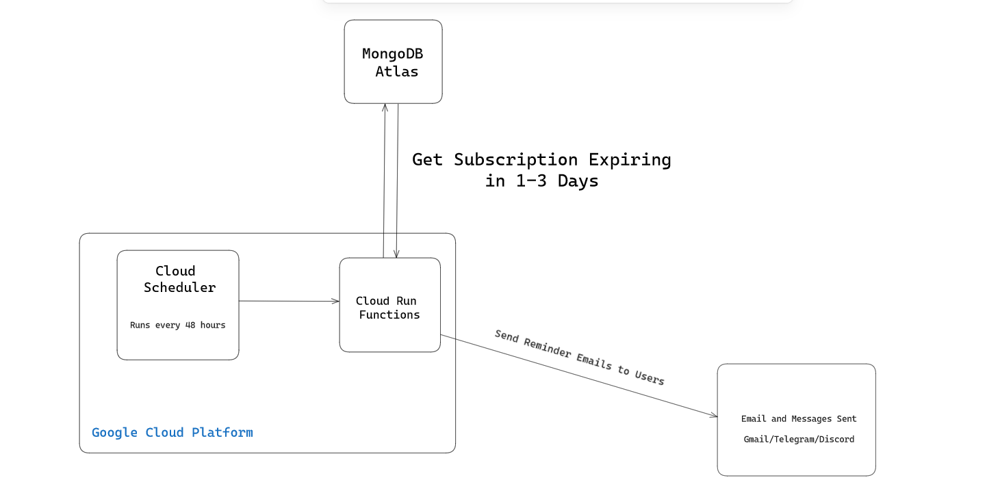
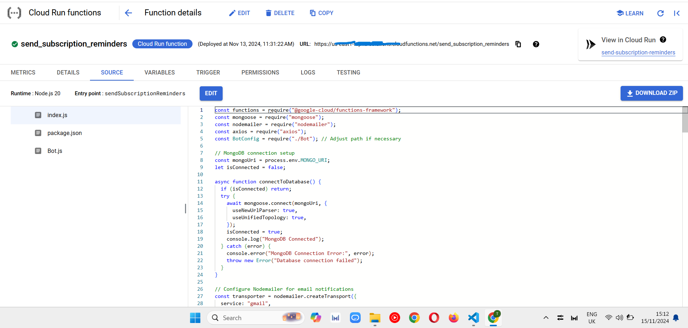
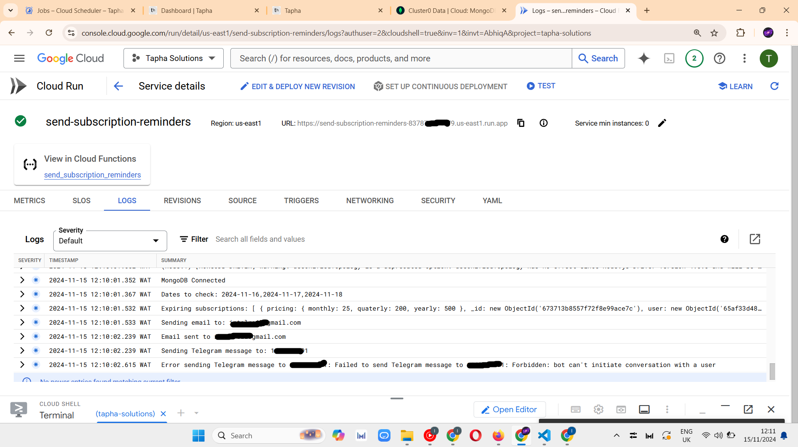
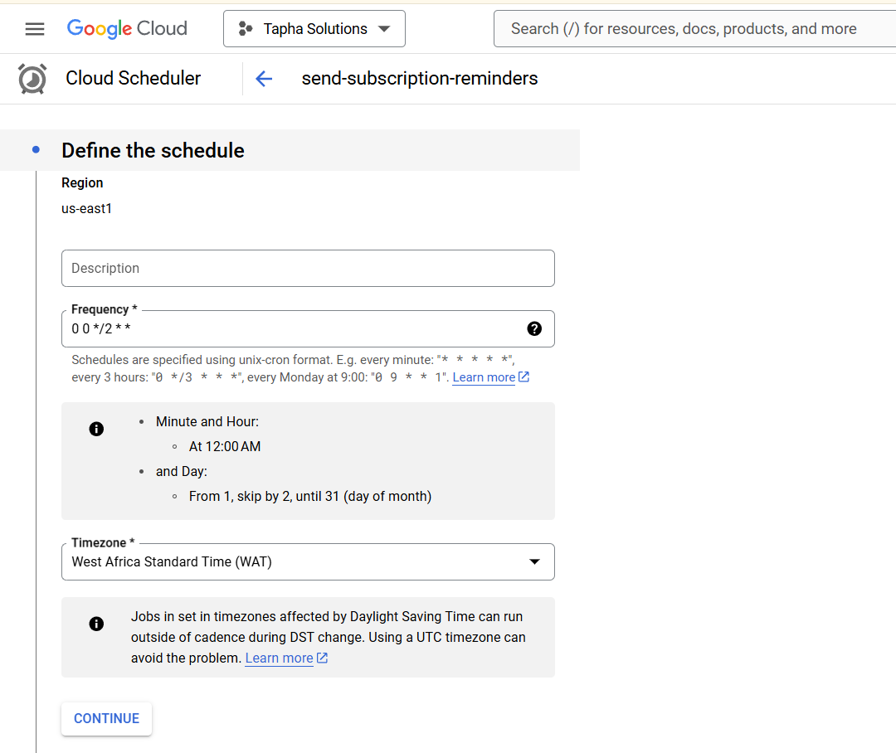
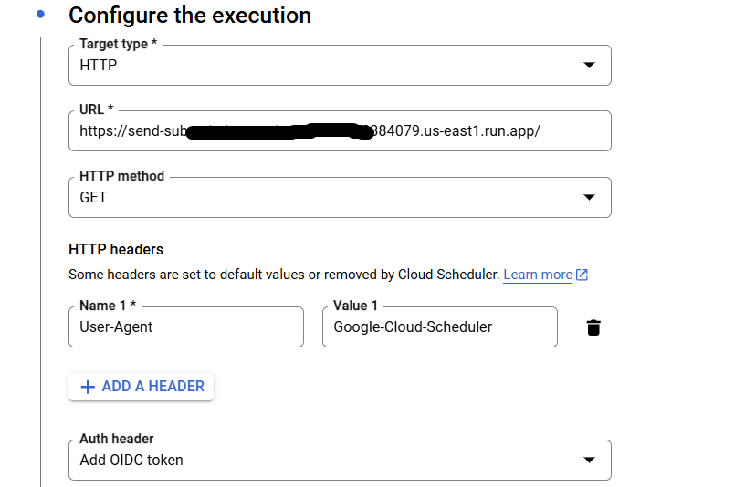
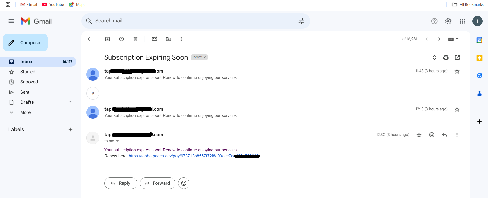

Managing subscriptions effectively is crucial for Tapha, a platform designed to help community managers streamline operations for paid groups on Telegram and Discord. Tapha handles everything from processing group memberships to monitoring user activity and even sending out notifications.

Recently, I implemented a subscription reminder system on Tapha. This feature notifies users 1–3 days before their subscription expires, including a renewal link to ensure continuity.
Using the Google Cloud Platform (GCP), I created a cost-effective and efficient solution. Here’s how I achieved it.

## The Requirements

I needed a system that would:

1. Run automatically every two days at 12 AM West Africa Time (WAT).
1. Scan the MongoDB Atlas database for subscriptions expiring in the next 1–3 days.
1. Notify users via email, Telegram, or Discord, including the renewal link.
1. Minimize resource usage while ensuring reliable execution.

Given these requirements, I chose Cloud Scheduler and Cloud Functions as the ideal GCP services to handle this task.

## Why GCP Cloud Scheduler and Cloud Functions?

1. Cloud Functions:

   - Eliminates the need for running Virtual Machines (VMs) or Cloud Run instances.
   - Can operate with minimal memory and scale automatically.
   - Allows precise control of execution with managed service accounts.

1. Cloud Scheduler:

   - Automates the task of triggering the Cloud Function at predefined intervals.
   - Simplifies scheduling logic without requiring a continuously running server.

These services complement each other perfectly for my use case, ensuring cost-efficiency and simplicity.

## The Architecture

Below is the architecture of the subscription reminder system:

- Cloud Scheduler triggers the Cloud Function every two days.
- Cloud Function fetches data from MongoDB Atlas, processes it, and sends reminders via email, Telegram, or Discord.
- MongoDB Atlas stores all subscription details, including renewal links.

## Setting Up Cloud Function

Here’s how I configured the Cloud Function:

1. Region Selection:

   - I chose us-east1 because my MongoDB database is hosted in this region, minimizing latency.

1. Authentication:

   - Enabled require authentication to restrict access to the Cloud Function, ensuring it’s only accessible to authorized users or services.

1. Autoscaling:

   - Configured a maximum of 2 instances, as the function does not require extensive scaling.

1. Code Structure

   - The index.js file contains the core logic for processing database entries and sending notifications.
   - The bot.js file defines the MongoDB schema for storing bot-related data.
   - All required dependencies are listed in package.json.

**File Structure Visualisation**

## Debugging with Logs

To ensure seamless execution, I enabled detailed logging for debugging and monitoring.

This approach allowed me to trace issues such as misconfigured environment variables or API errors when sending notifications.

## Setting Up Cloud Scheduler

Configuring the Cloud Scheduler was straightforward:

- Set the schedule to run every 2 days at 12 AM WAT.
- Configure the target execution to invoke the deployed Cloud Function.

### Configure Execution Settings

In the execution settings:

- Target Type: HTTP
- URL: The deployed Cloud Function URL
- HTTP Method: GET

## The Final Result

Here’s an example of a successful execution:

- The system queried the database, identified expiring subscriptions, and sent notifications with renewal links via email and messaging platforms.
- Users received personalized reminders, ensuring timely subscription renewals.

## Major Takeaways

- GCP Cloud Functions is ideal for running lightweight, scheduled tasks that require minimal resources.
- Cloud Scheduler simplifies task scheduling without needing a dedicated server.
- Using us-east1 reduced database query latency significantly, improving performance.
- Detailed logging was instrumental in identifying and resolving potential issues during implementation.

## Next Steps

If you’re building a notification system for subscription management or a similar use case, consider using Google Cloud Scheduler and Cloud Functions. These tools provide a reliable, scalable, and cost-effective solution for automation.

Feel free to share your thoughts, and let’s discuss how you’d implement similar systems in your projects!
